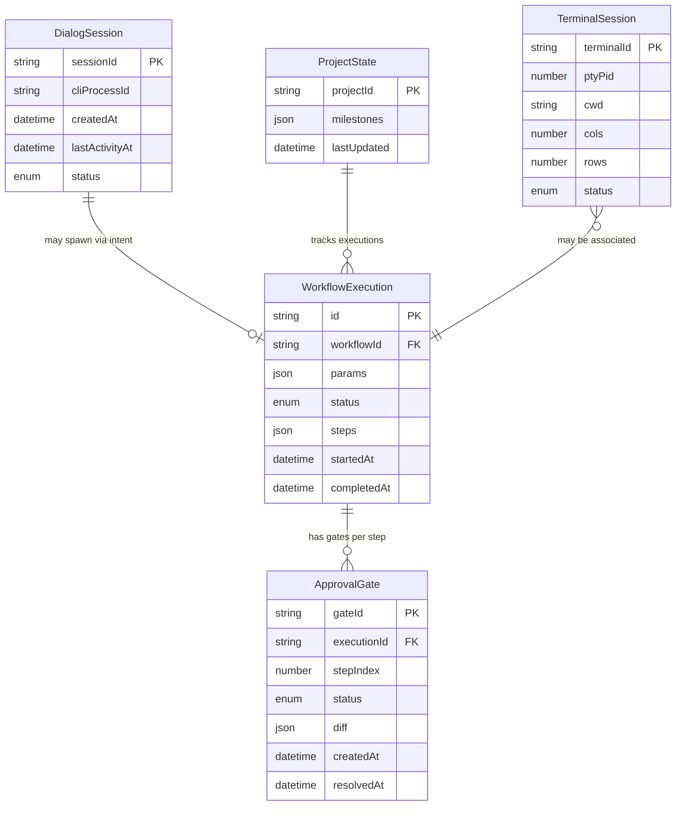

# Maestro IDE -- Architecture Overview

> Blueprint: BLP-maestro-ide-2026-06-20
> Status: Draft
> Last Updated: 2026-06-20

---

## 1. System Architecture Diagram

```mermaid
graph TD
    subgraph Browser["Browser (SvelteKit Frontend)"]
        UI_CMD["Workflow Commander<br/>F-001"]
        UI_RADAR["Project Radar<br/>F-002"]
        UI_DIALOG["AI Dialog<br/>F-003"]
        UI_TERM["Terminal Bridge<br/>xterm.js F-004"]
        UI_GATE["Approval Gate<br/>F-007"]
        UI_XLATE["Detail Level Toggle<br/>F-006 client"]
    end

    subgraph Server["Node.js Backend (localhost:3210)"]
        HTTP["HTTP REST API"]
        WS_GW["WebSocket Gateway"]

        subgraph Core["Core Services"]
            BUS["Event Bus"]
            STORE["Event Store<br/>(Ring Buffer)"]
            SNAP["Snapshot Service"]
            PTY_MGR["PTY Manager"]
        end

        subgraph Features["Feature Services"]
            WF_CAT["Workflow Catalog Service"]
            WF_EXEC["Workflow Executor Service"]
            PROJ_ST["Project State Service"]
            REC["Recommendation Engine"]
            DIALOG_MGR["Dialog Session Manager"]
            INTENT["Intent Router"]
            STREAM["Streaming Bridge"]
            GATE_DET["Gate Detector"]
            DIFF_R["Diff Renderer"]
            APPROVAL["Approval State Machine"]
        end

        subgraph Middleware["Middleware"]
            XLATE["Concept Translator"]
            CLI_ADAPT["CLI Output Adapter<br/>(Versioned)"]
        end

        subgraph Watchers["Watchers"]
            FS_W["File-System Watcher"]
        end
    end

    subgraph CLI["maestro CLI (Child Processes)"]
        MAESTRO["maestro ralph skills --json"]
        DELEGATE["maestro delegate ..."]
        CLAUDE_CC["Claude Code CLI"]
    end

    UI_CMD -->|REST + WS| HTTP
    UI_RADAR -->|REST + WS| HTTP
    UI_DIALOG -->|REST + WS| HTTP
    UI_TERM -->|WS term:*| WS_GW
    UI_GATE -->|REST + WS| HTTP

    HTTP --> WF_CAT
    HTTP --> WF_EXEC
    HTTP --> PROJ_ST
    HTTP --> DIALOG_MGR
    HTTP --> APPROVAL

    WS_GW --> BUS
    BUS --> STORE
    BUS --> SNAP
    BUS --> WS_GW

    WF_CAT -->|spawn| MAESTRO
    WF_EXEC -->|spawn| DELEGATE
    DIALOG_MGR -->|spawn| CLAUDE_CC
    STREAM --> CLAUDE_CC

    PTY_MGR -->|node-pty| DELEGATE
    PTY_MGR -->|node-pty| CLAUDE_CC

    CLI_ADAPT --> WF_EXEC
    CLI_ADAPT --> STREAM
    CLI_ADAPT --> DIFF_R

    XLATE --> WS_GW
    XLATE --> HTTP

    GATE_DET --> APPROVAL
    APPROVAL --> WF_EXEC

    FS_W --> PROJ_ST
    PROJ_ST --> BUS
    WF_EXEC --> BUS
    DIALOG_MGR --> BUS
    PTY_MGR --> BUS
    APPROVAL --> BUS

    INTENT --> WF_EXEC
    INTENT --> PROJ_ST
    INTENT --> STREAM
```



---

## 2. Component List

| Component | Layer | Responsibility | Key Interfaces |
|-----------|-------|----------------|----------------|
| **Workflow Commander** | Frontend | Workflow catalog display, execution trigger, step progress visualization | `GET /api/workflows`, `POST /api/workflows/:id/execute`, `WS workflow:step-update` |
| **Project Radar** | Frontend | Project status dashboard, milestone/phase/step tree, next-step recommendations | `GET /api/projects/:id/state`, `WS project:state-update`, `GET /api/projects/:id/recommendations` |
| **AI Dialog** | Frontend | Natural language chat interface, streaming markdown output, intent routing feedback | `POST /api/dialog/sessions`, `WS dialog:stream-chunk`, `WS dialog:intent-routed` |
| **Terminal Bridge** | Frontend | xterm.js terminal emulator, keystroke input, resize handling | `POST /api/terminals`, `WS term:output/input/resize` |
| **Approval Gate** | Frontend | Approval/rejection UI, diff preview, dry-run summary | `WS gate:pending`, `POST /api/gates/:id/approve`, `POST /api/gates/:id/reject` |
| **Detail Level Toggle** | Frontend | Simple/advanced mode switch, controls Concept Translator behavior | `X-Detail-Level` header |
| **HTTP REST API** | Backend | Synchronous request/response endpoints for catalog, state, actions | All `GET/POST/DELETE /api/*` routes |
| **WebSocket Gateway** | Backend | Persistent bidirectional connections, subscription protocol, heartbeat | `WS /ws`, subscribe/unsubscribe protocol |
| **Event Bus** | Backend Core | In-process typed pub/sub, FIFO per channel, no-drop guarantee | `EventBus.publish(channel, event)`, `EventBus.subscribe(channel, handler)` |
| **Event Store** | Backend Core | In-memory ring buffer, replay on new connection, last N events per channel | Internal to Event Bus |
| **Snapshot Service** | Backend Core | Periodic full-state snapshots (30s), state reconciliation for clients | `WS state:snapshot` |
| **PTY Manager** | Backend Core | node-pty lifecycle, spawn/kill/resize, session limit enforcement (max 5) | `POST /api/terminals`, `DELETE /api/terminals/:id` |
| **Workflow Catalog Service** | Backend Feature | Wraps `maestro ralph skills --json --quiet`, structured workflow metadata | `GET /api/workflows` |
| **Workflow Executor Service** | Backend Feature | Spawns child process per workflow, tracks step progress, supports cancellation | `POST /api/workflows/:id/execute` |
| **Project State Service** | Backend Feature | Aggregates milestone/phase/step tree from project files, dual-source state model | `GET /api/projects/:id/state` |
| **Recommendation Engine** | Backend Feature | Rule-based next-step logic from current project state | `GET /api/projects/:id/recommendations` |
| **Dialog Session Manager** | Backend Feature | Per-session CLI process lifecycle, idle timeout, session cleanup | `POST /api/dialog/sessions` |
| **Intent Router** | Backend Feature | Message classification (workflow/status/freeform), dispatch to handlers | Internal dispatch |
| **Streaming Bridge** | Backend Feature | CLI stdout to WebSocket chunked streaming, sentence/code-block boundaries | `WS dialog:stream-chunk` |
| **Gate Detector** | Backend Feature | Monitors execution events, detects approval-required steps, pauses process | `WS gate:pending` |
| **Diff Renderer** | Backend Feature | Extracts diff from CLI output via adapter, unified diff format, binary fallback | `GET /api/gates/:id/diff` |
| **Approval State Machine** | Backend Feature | Gate lifecycle: created -> pending -> approved/rejected/expired, audit logging | `POST /api/gates/:id/approve`, `POST /api/gates/:id/reject` |
| **Concept Translator** | Backend Middleware | Term substitution on all responses, simple/advanced mode, hot-reload registry | `Translator.translate(payload, level)` |
| **CLI Output Adapter** | Backend Middleware | Versioned CLI output parsers, startup version detection, graceful degradation | Internal to feature services |
| **File-System Watcher** | Backend Watcher | chokidar on project metadata files, debounced events (200ms), externally-triggered labeling | Internal to Project State Service |

---

## 3. Technology Stack

| Layer | Technology | Version | Rationale |
|-------|-----------|---------|-----------|
| **Backend Runtime** | Node.js | >=20 LTS | Native `child_process`/`node-pty` support; event loop aligns with WebSocket architecture |
| **Backend Framework** | Express.js (or Hono) | 4.x / latest | Lightweight HTTP server; WebSocket via `ws` library; middleware chain for Concept Translator |
| **WebSocket Library** | `ws` | 8.x | Minimal overhead; no socket.io abstraction needed for single-user local app; per-message compression optional |
| **PTY Management** | `node-pty` | latest | Full pseudoterminal support required by xterm.js; conpty on Windows, forkpty on Unix |
| **Frontend Framework** | SvelteKit | 2.x | Compile-time reactivity; small bundle; server-side rendering for initial load; file-based routing |
| **Terminal Emulator** | xterm.js | 5.x | Full terminal in browser; addon ecosystem (fit, web-links, search); WebSocket data pipe |
| **File Watching** | chokidar | 3.x | Cross-platform fs.watch wrapper; debouncing; efficient for project metadata directories |
| **Event Bus** | Node.js EventEmitter | built-in | In-process pub/sub; typed channels via wrapper; no external dependency needed |
| **State Serialization** | JSON | built-in | All event payloads JSON-serializable; no binary protocol needed for local app |
| **Process Management** | Node.js `child_process` | built-in | `spawn` for CLI subprocesses; exit code inspection; signal handling (SIGINT, SIGTSTP on Unix) |
| **Testing** | Vitest + Playwright | latest | Vitest for unit/integration; Playwright for E2E browser tests |
| **Build** | Vite (via SvelteKit) | 5.x | Fast HMR; Svelte plugin; production bundling |
| **Linting** | ESLint + Prettier | latest | Consistent code style; Svelte plugin |

---

## 4. Data Model



### Entity Definitions

**WorkflowExecution**

| Field | Type | Description |
|-------|------|-------------|
| `id` | string (UUID) | Unique execution identifier |
| `workflowId` | string | Reference to WorkflowMeta.id from catalog |
| `params` | JSON object | User-provided parameters for this run |
| `status` | enum: `queued` \| `running` \| `paused` \| `completed` \| `failed` \| `cancelled` \| `interrupted` | Current execution state |
| `steps` | Step[] | Ordered list of step states; Step = { index, name, status, output?, startedAt?, completedAt? } |
| `startedAt` | ISO 8601 | Execution start timestamp |
| `completedAt` | ISO 8601 | Execution end timestamp (null if running) |

**ProjectState**

| Field | Type | Description |
|-------|------|-------------|
| `projectId` | string | Project root path (unique per local app) |
| `milestones` | Milestone[] | Hierarchical project tree; Milestone = { id, name, phases: Phase[] }; Phase = { id, name, steps: StepMeta[] } |
| `lastUpdated` | ISO 8601 | Last aggregation timestamp |

**DialogSession**

| Field | Type | Description |
|-------|------|-------------|
| `sessionId` | string (UUID) | Unique session identifier |
| `cliProcessId` | number | OS PID of the associated Claude Code CLI child process |
| `createdAt` | ISO 8601 | Session creation timestamp |
| `lastActivityAt` | ISO 8601 | Last message timestamp (used for idle timeout) |
| `status` | enum: `active` \| `idle` \| `terminated` | Session lifecycle state |

**TerminalSession**

| Field | Type | Description |
|-------|------|-------------|
| `terminalId` | string (UUID) | Unique terminal identifier |
| `ptyPid` | number | OS PID of the node-pty process |
| `cwd` | string | Current working directory |
| `cols` | number | Terminal column width |
| `rows` | number | Terminal row height |
| `status` | enum: `spawning` \| `running` \| `exited` \| `crashed` | PTY lifecycle state |

**ApprovalGate**

| Field | Type | Description |
|-------|------|-------------|
| `gateId` | string (UUID) | Unique gate identifier |
| `executionId` | string (FK) | Reference to WorkflowExecution.id |
| `stepIndex` | number | Step within the workflow that triggered this gate |
| `status` | enum: `created` \| `pending` \| `awaiting_input` \| `approved` \| `rejected` \| `expired` | Gate lifecycle state |
| `diff` | DiffView? | Optional diff preview; DiffView = { files: FileDiff[] } |
| `dryRunResult` | string? | Optional dry-run output preview |
| `createdAt` | ISO 8601 | Gate creation timestamp |
| `resolvedAt` | ISO 8601 | Gate resolution timestamp (null if pending) |

---

## 5. State Machines

### 5.1 WorkflowExecution State Machine

```
                    +---------+
                    | queued  |
                    +----+----+
                         |
                    +----v----+
            +------>| running |<------+
            |       +----+----+       |
            |            |            |
            |   +--------+--------+  |
            |   |                 |  |
       +----v---v--+       +------v--v----+
       |  paused   |       |   failed    |
       +----+------+       +-------------+
            |
       +----v----+
       | resumed  |---(re-enters running)
       +---------+

       +----+----+        +-----------+
       | cancelled|        | completed |
       +---------+        +-----------+

       +------------+
       | interrupted|  (server crash recovery)
       +------------+
```

**Transition Table**

| From | To | Trigger | Side Effect |
|------|----|---------|-------------|
| `queued` | `running` | Child process spawned successfully | Emit `workflow:started`, set `startedAt` |
| `running` | `paused` | Approval gate created for current step | Emit `gate:pending`, pause child process |
| `running` | `completed` | Child process exits with code 0 | Emit `workflow:completed`, set `completedAt` |
| `running` | `failed` | Child process exits with non-zero code | Emit `workflow:failed`, set `completedAt` |
| `running` | `cancelled` | User cancels or gate rejected | SIGINT child process, emit `workflow:cancelled` |
| `paused` | `running` | Gate approved | Resume child process, emit `workflow:resumed` |
| `paused` | `cancelled` | Gate rejected or expired | SIGINT child process, emit `workflow:cancelled` |
| `running` | `interrupted` | Server crash recovery on restart | Mark all in-flight executions, present manual recovery |

### 5.2 ApprovalGate State Machine

```
                 +-----------+
                 |  created  |
                 +-----+-----+
                       |
                 +-----v-----+
          +----->|   pending  |
          |      +-----+-----+
          |            |
          |   +--------+--------+
          |   |                 |
    +-----v---v--+     +-------v--------+
    |  expired   |     | awaiting_input  |
    +-----+------+     +-------+---------+
          |                     |
          |            +--------+--------+
          |            |                 |
    +-----v-----+ +---v--------+ +-----v------+
    | rejected  | |  approved  | |  rejected  |
    +-----------+ +------------+ +------------+
```

**Transition Table**

| From | To | Trigger | Side Effect |
|------|----|---------|-------------|
| `created` | `pending` | Step marked `requiresApproval: true` | Pause child process, emit `gate:pending` |
| `pending` | `expired` | 10-minute timeout (GATE_EXPIRY_MS) | Reject gate, SIGINT child process |
| `pending` | `awaiting_input` | User opens approval panel | Display diff preview |
| `awaiting_input` | `approved` | `POST /api/gates/:id/approve` | Resume child process, log decision with timestamp |
| `awaiting_input` | `rejected` | `POST /api/gates/:id/reject` | SIGINT child process, log decision with timestamp |
| `expired` | `rejected` | Automatic (terminal state) | Emit `gate:rejected` event |

**Safety Constraints**:
- The system MUST NOT auto-approve any step marked `requiresApproval: true`.
- Gate expiry MUST default to 10 minutes; expired gates MUST default to rejected.
- Approval decisions MUST be logged with timestamp and user identity for audit.
- The system MUST NOT allow state transitions from terminal states (`approved`, `rejected`).

---

## 6. Security Architecture

### 6.1 Threat Model

Maestro IDE is a **local-only** application. The threat model is scoped accordingly:

| Threat | Severity | Mitigation |
|--------|----------|------------|
| Remote code injection via WebSocket | HIGH | Server MUST bind to `127.0.0.1` only; MUST NOT bind to `0.0.0.0` |
| CSRF from malicious web pages | MEDIUM | All mutating endpoints MUST validate `Origin: http://localhost:PORT`; WebSocket handshake MUST verify Origin |
| Path traversal in API requests | HIGH | All file-path parameters MUST be validated against the project root; `..` traversal MUST be rejected |
| Unbounded resource consumption | MEDIUM | Terminal session limit (5), WebSocket connection limit (10), event ring buffer cap (1000) |
| CLI command injection | HIGH | Workflow parameters MUST be passed as structured arguments, never shell-interpolated; `shell: true` MUST NOT be used in `child_process.spawn` |

### 6.2 Security Controls

1. **Network Binding**: The HTTP/WebSocket server MUST bind exclusively to `127.0.0.1`. Binding to `0.0.0.0` or any public interface MUST cause a startup failure.

2. **Origin Validation**: All incoming HTTP and WebSocket requests MUST carry `Origin: http://localhost:PORT` or `Origin: http://127.0.0.1:PORT`. Requests with missing or mismatched Origin MUST be rejected with 403.

3. **Command Sanitization**: Workflow parameters from the frontend MUST be passed as an array of arguments to `child_process.spawn`, never interpolated into a shell command string. The `shell: true` option MUST NOT be used.

4. **Path Validation**: Any API endpoint that accepts a file path MUST resolve it against the project root and verify the resolved path is within the project boundary. Paths containing `..` that escape the project root MUST be rejected.

5. **Resource Limits**: The server MUST enforce hard limits on concurrent resources:
   - Max 5 terminal sessions
   - Max 10 WebSocket connections
   - Max 1000 events in ring buffer per channel
   - Max 10 concurrent CLI child processes

6. **Audit Trail**: All approval gate decisions (approve/reject) MUST be logged with timestamp, gate ID, execution ID, and a user identifier (browser tab / session ID for local app).

7. **No Persistent Secrets**: The local app MUST NOT store API keys, tokens, or credentials. Claude Code CLI manages its own authentication; the wrapper MUST NOT intercept or store auth tokens.

---

## 7. Configuration Model

All configuration parameters MUST be overridable via environment variables. The server MUST validate all values at startup and MUST NOT start with invalid configuration.

| Parameter | Env Var | Default | Validation | Scope |
|-----------|---------|---------|------------|-------|
| Port | `PORT` | `3210` | Integer in range [1024, 65535] | Server startup |
| WebSocket Heartbeat | `WS_HEARTBEAT_INTERVAL_MS` | `30000` | Integer >= 5000 | WebSocket Gateway |
| Event Ring Buffer Size | `EVENT_RING_BUFFER_SIZE` | `1000` | Integer >= 100 | Event Store |
| Snapshot Interval | `SNAPSHOT_INTERVAL_MS` | `30000` | Integer >= 10000 | Snapshot Service |
| Max Terminal Sessions | `MAX_TERMINAL_SESSIONS` | `5` | Integer >= 1 | PTY Manager |
| Gate Expiry Timeout | `GATE_EXPIRY_MS` | `600000` | Integer >= 60000 (1 min) | Approval State Machine |
| Dialog Idle Timeout | `DIALOG_IDLE_TIMEOUT_MS` | `600000` | Integer >= 60000 (1 min) | Dialog Session Manager |
| Detail Level | `DETAIL_LEVEL` | `simple` | One of: `simple`, `advanced` | Concept Translator |
| CLI Path | `MAESTRO_CLI_PATH` | `maestro` | Non-empty string; MUST resolve to executable at startup | CLI Adapter |
| Project Root | `PROJECT_ROOT` | `process.cwd()` | MUST be an existing directory path | Project State Service |
| Log Level | `LOG_LEVEL` | `info` | One of: `debug`, `info`, `warn`, `error` | All services |
| FS Watch Debounce | `FS_WATCH_DEBOUNCE_MS` | `200` | Integer >= 50 | File-System Watcher |
| WS Replay Limit | `WS_REPLAY_LIMIT` | `100` | Integer >= 0 | WebSocket Gateway |
| Max Child Processes | `MAX_CHILD_PROCESSES` | `10` | Integer >= 1 | Workflow Executor |

**Startup Validation Sequence**:
1. Parse all environment variables
2. Validate each against its constraint
3. Probe `MAESTRO_CLI_PATH` -- execute `maestro --version`; fail fast if not found
4. Select CLI adapter matching the detected version
5. Bind HTTP server to `127.0.0.1:PORT`; fail if port occupied
6. Start WebSocket Gateway
7. Initialize Event Bus, Event Store, Snapshot Service
8. Report health via `GET /api/health`

---

## 8. Error Handling Strategy

### 8.1 Error Classification

| Tier | Examples | Response | Recovery |
|------|----------|----------|----------|
| **Recoverable** | CLI adapter parse failure, transient WebSocket disconnect, file read timeout | Retry with exponential backoff (max 3 attempts); degrade gracefully showing partial data with warning badge | Automatic; user sees warning indicator |
| **Degraded** | File-system watcher failure, conpty resize error, snapshot service failure | Log error; switch to polling fallback (30s interval); display "live updates paused" indicator | Automatic fallback; manual refresh available |
| **Fatal** | Port conflict, maestro CLI not found, incompatible CLI version, invalid configuration | Fail fast with clear error message and non-zero exit code; MUST NOT start in partially functional state | User must resolve and restart |

### 8.2 Error Propagation Rules

1. All CLI child process crashes MUST be captured via exit-code inspection.
2. Crashes during workflow execution MUST be reported as `workflow:step-error` events.
3. Crashes during terminal sessions MUST be reported as `terminal:exit` events.
4. The State Sync Engine MUST propagate error state to all subscribed WebSocket clients within 100ms.
5. Error messages MUST pass through the Concept Translator before reaching the frontend.
6. The frontend MUST display error states with actionable guidance, not raw stack traces.

### 8.3 Graceful Shutdown Sequence

On receiving SIGTERM or SIGINT:

1. Stop accepting new HTTP requests and WebSocket connections
2. Drain pending events from the Event Bus (max 5 seconds wait)
3. SIGINT all child processes (CLI, PTY)
4. Wait for child process exit (max 3 seconds per process)
5. Close all WebSocket connections with close code 1001 (going away)
6. Close HTTP server
7. Exit within 10 seconds total

### 8.4 Crash Recovery

- The system SHOULD NOT attempt automatic workflow resumption on restart.
- All in-flight WorkflowExecution records MUST be marked as `interrupted`.
- The user MUST be presented with a manual recovery option on the dashboard.
- The Event Store ring buffer is in-memory only; replay-from-scratch is acceptable after restart.

---

## 9. Observability

### 9.1 Key Metrics

| Metric | Target | Collection Method |
|--------|--------|-------------------|
| WebSocket event delivery latency | < 100ms p99 | Server-side histogram: EventBus.publish timestamp to WS send timestamp |
| CLI child process spawn time | < 500ms p99 | Server-side timer on spawn call to process ready |
| File-system watcher event-to-UI latency | < 500ms | End-to-end timestamp diff: fs event time to WS delivery time |
| WebSocket connection uptime | > 99.5% | Heartbeat success rate (30s interval); track disconnect count |
| Active terminal sessions | <= 5 per user | Gauge on PTY Manager; alert on limit approach |
| Event ring buffer utilization | < 80% capacity | Gauge on Event Store; alert on threshold breach |
| Approval gate resolution time | < 10 min (before expiry) | Timer from `gate:pending` to resolved; alert on approaching expiry |
| Concept translator processing overhead | < 10ms per response | Server-side timer on `translate()` call |
| Intent routing latency | < 100ms | Server-side timer on intent classification |
| Streaming chunk delivery latency | < 50ms | Timer from CLI stdout chunk to WS send |

### 9.2 Structured Log Events

All log events MUST use JSON format with the following envelope:

```json
{
  "timestamp": "2026-06-20T12:00:00.000Z",
  "level": "info|warn|error",
  "event": "event-type",
  "correlationId": "uuid",
  "payload": { }
}
```

**Mandatory Log Events**:

| Event | Level | Payload Fields |
|-------|-------|----------------|
| `server.started` | info | port, cliVersion, adapterVersion |
| `server.stopping` | info | reason, activeConnections, activeProcesses |
| `ws.connected` | info | connectionId, channels |
| `ws.disconnected` | info | connectionId, reason, duration |
| `cli.spawned` | info | processId, command, executionId? |
| `cli.exited` | info | processId, exitCode, duration |
| `workflow.started` | info | executionId, workflowId |
| `workflow.completed` | info | executionId, duration, stepCount |
| `workflow.failed` | error | executionId, stepIndex, errorMessage |
| `gate.created` | info | gateId, executionId, stepIndex |
| `gate.resolved` | info | gateId, decision, resolutionTimeMs |
| `gate.expired` | warn | gateId, executionId |
| `adapter.parse-error` | warn | adapterVersion, rawOutput, error |
| `translator.miss` | debug | term, level |
| `health.check` | info | status, uptime, wsConnections, activeProcesses |

### 9.3 Health Check

**Endpoint**: `GET /api/health`

**Response**:

```json
{
  "status": "healthy | degraded | unhealthy",
  "uptime": 3600,
  "wsConnections": 2,
  "activeProcesses": 3,
  "cliVersion": "1.2.3",
  "adapterVersion": "1.2.3-v1",
  "lastSnapshotAt": "2026-06-20T12:00:00.000Z",
  "checks": {
    "cliAvailable": true,
    "wsGateway": true,
    "eventBus": true,
    "fsWatcher": true
  }
}
```

**Status Logic**:
- `healthy`: All checks pass, active processes within limits
- `degraded`: One or more non-critical checks failing (fsWatcher down, adapter parse errors)
- `unhealthy`: Critical check failing (CLI not available, WS gateway down)

---

## 10. Cross-Cutting Constraints Summary

| ID | Constraint | RFC 2119 |
|----|-----------|----------|
| C-001 | Product MUST be a terminal companion, not a terminal replacement | MUST |
| C-002 | MVP core value MUST be workflow orchestration + state visualization | MUST |
| C-003 | Product MUST use local web app architecture | MUST |
| C-004 | Claude Code integration MUST use gradual strategy: CLI subprocess first | MUST |
| C-005 | State sync MUST use event-driven + WebSocket architecture; polling MUST NOT be used | MUST / MUST NOT |
| C-006 | Backend MUST use Node.js; frontend MUST use SvelteKit | MUST |
| C-007 | CLI output parsing MUST be abstracted into adapter layer; raw CLI text MUST NOT reach frontend | MUST / MUST NOT |
| C-008 | Product MUST hide maestro technical concepts; intent-driven interaction | MUST |
| C-009 | Primary interaction MUST be state-oriented | MUST |
| C-010 | Users MUST be able to use natural language; system auto-routes to workflow | MUST |
| XC-001 | Each CLI invocation MUST run as separate child process; shared-process prohibited | MUST |
| XC-002 | CLI adapters MUST be versioned; system MUST detect CLI version at startup | MUST |
| XC-003 | Windows conpty quirks MUST be handled; Unix signals MUST NOT be assumed on Windows | MUST / MUST NOT |
| XC-004 | State Sync MUST merge in-process and file-system watcher events; externally triggered changes MUST be labeled | MUST |
| XC-005 | All responses MUST pass through Concept Translator; raw terms MUST NOT leak in simple mode | MUST / MUST NOT |
| XC-006 | System MUST enforce max 5 terminal sessions and 10 WebSocket connections | MUST |
| XC-007 | Translations MUST NOT modify data values; only keys and labels | MUST NOT |
| XC-008 | Approval decisions MUST be logged with timestamp and user identity | MUST |
| XC-009 | Server MUST bind to 127.0.0.1 only; MUST NOT bind to 0.0.0.0 | MUST / MUST NOT |
| XC-010 | shell: true MUST NOT be used in child_process.spawn | MUST NOT |

---

## 11. Outstanding Architecture TODOs

1. **CLI adapter version detection**: Implement startup probe of `maestro --version`; define adapter interface contract with per-version test fixtures.
2. **WorkflowMeta schema**: Sample actual `maestro ralph skills --json --quiet` output to finalize the WorkflowMeta type definition.
3. **PTY pause mechanism for Windows**: Investigate alternatives to SIGTSTP/SIGCONT for Approval Gate process pausing on conpty.
4. **Dual-source state reconciliation**: Define the event schema that merges in-process execution events with file-system watcher events, including the externally-triggered label.
5. **WebSocket library selection**: Confirm `ws` over `socket.io` for single-user local app.
6. **Event type taxonomy**: Define the complete typed event catalog for all channels (`workflow:*`, `project:*`, `dialog:*`, `terminal:*`, `gate:*`).
7. **Intent classification strategy**: Determine rule-based vs. hybrid approach for MVP.
8. **Translation registry completeness**: Map all maestro terms to user-facing labels; define handling for untranslated terms.
9. **Ring buffer persistence**: Evaluate whether disk backing is needed for crash recovery or if replay-from-scratch is acceptable.
10. **Claude Code CLI session model**: Determine whether Claude Code supports interactive stdin/stdout sessions or requires per-command invocation.
