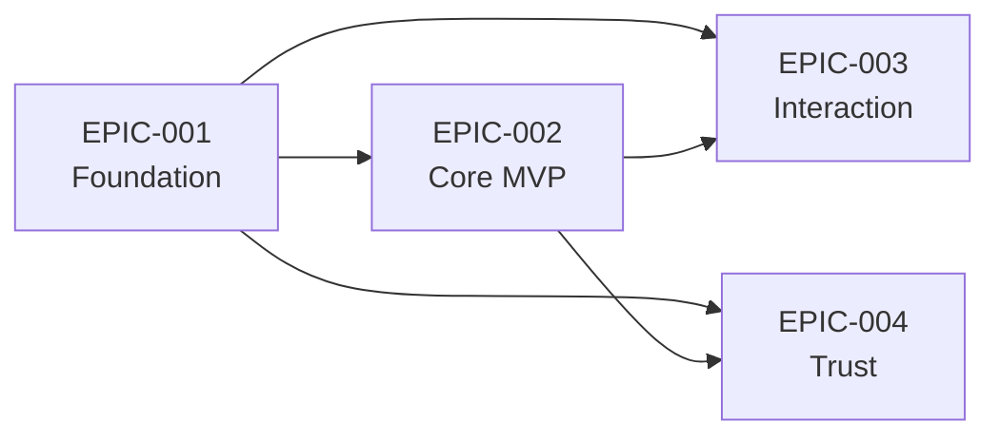

# Maestro IDE -- Epic & Story Index

## Epic Overview

| ID | Title | Stories | MVP | Phase | Dependencies |
|----|-------|---------|-----|-------|-------------|
| EPIC-001 | Foundation -- State Sync Engine + Concept Translator | 5 | Yes | Foundation | -- |
| EPIC-002 | Core MVP -- Project Radar + Workflow Commander | 5 | Yes | Core MVP | EPIC-001 |
| EPIC-003 | Interaction -- Terminal Bridge + AI Dialog | 5 | Yes | Interaction | EPIC-001, EPIC-002 |
| EPIC-004 | Trust -- Approval Gate | 3 | Partial | Trust | EPIC-001, EPIC-002 |

## Cross-Epic Dependency Map

**Dependency Details**:
- EPIC-002 依赖 EPIC-001: Project Radar 的实时状态推送依赖 State Sync Engine; Workflow Commander 和 Project Radar 的所有用户可见文本依赖 Concept Translator
- EPIC-003 依赖 EPIC-001: Terminal Bridge 的进程生命周期事件通过 State Sync Engine 传播; AI Dialog 的流式输出和意图路由结果需 Concept Translator 处理
- EPIC-003 依赖 EPIC-002: AI Dialog 意图路由的 workflow 分支依赖 Workflow Commander 的执行管线; Terminal Bridge 需关联 Workflow Commander 的子进程
- EPIC-004 依赖 EPIC-001: Approval Gate 状态变更通过 State Sync Engine 推送; 审批 UI 中的术语需 Concept Translator 处理
- EPIC-004 依赖 EPIC-002: Approval Gate 拦截 Workflow Commander 的执行步骤; diff 预览需读取项目文件状态

## MVP Subset

**MVP 包含**: EPIC-001, EPIC-002, EPIC-003 全部, EPIC-004 核心部分 (仅高风险操作审批)

**MVP 排除**: EPIC-004 的可配置审批粒度 (per-workflow batch approval) 和 dry-run 预览

**MVP 交付顺序**:

| 顺序 | Epic | 理由 |
|------|------|------|
| 1 | EPIC-001 | 所有其他 Epic 的前置依赖; 不先交付则后续功能无法运行 |
| 2 | EPIC-002 | 交付 PM-03 定义的核心价值: 工作流编排 + 状态可视化; 用户首次可用 |
| 3 | EPIC-003 | 增强交互能力; Terminal Bridge 提供透明度, AI Dialog 提供自然语言入口 |
| 4 | EPIC-004 | 补完信任层; 可渐进交付 -- 先覆盖高风险操作, 再扩展覆盖范围 |

**执行顺序原理**:
1. **Unblock before deliver** -- F-005 (State Sync Engine) 和 F-006 (Concept Translator) 是所有功能的横切依赖, 必须先交付
2. **Core before enhancement** -- F-001 (Workflow Commander) + F-002 (Project Radar) 交付核心价值, 用户可以打开应用、看到状态、触发工作流
3. **Trust before scale** -- F-007 (Approval Gate) 是生产使用的前提, 但不阻塞初始采用

## MVP Definition of Done

1. **状态可视化可用**: 用户打开应用后能实时看到项目 milestone/phase/step 状态, 外部 CLI 变更在 5 秒内反映 (S-002 synergy: 99% 准确率 + 500ms 延迟)
2. **工作流一键触发**: 用户可通过分类选择或场景分组触发完整工作流链路, 步骤进度实时更新 (PM-03, PM-04)
3. **概念无泄漏**: 简单模式下所有用户可见文本无原始 maestro 技术术语泄漏 (UX-01, C-008)
4. **终端透明可见**: 工作流执行期间用户可在嵌入终端看到实时 CLI 输出 (SA-05, PM-01)
5. **破坏性操作受控**: 文件修改类工作流步骤必须经过用户确认后才执行 (PM-10, UI-07)

## Traceability Matrix

| Epic | Story | Feature(s) | Constraint(s) | Decision(s) |
|------|-------|-----------|---------------|-------------|
| EPIC-001 | ST-001 | F-005 | C-005 | SA-03 |
| EPIC-001 | ST-002 | F-005 | C-005 | SA-03, S-002 |
| EPIC-001 | ST-003 | F-005 | C-005 | SA-03 |
| EPIC-001 | ST-004 | F-006 | C-008, C-007 | UX-01, UX-03 |
| EPIC-001 | ST-005 | F-006 | C-008 | UX-04, S-001 |
| EPIC-002 | ST-006 | F-002 | C-009 | UX-02, UX-06, PM-03 |
| EPIC-002 | ST-007 | F-002 | C-009 | UX-02, PM-08 |
| EPIC-002 | ST-008 | F-001 | C-002, C-010 | PM-04, PM-06 |
| EPIC-002 | ST-009 | F-001 | C-002, C-007 | SA-06, SA-07 |
| EPIC-002 | ST-010 | F-001+F-002 | C-002, C-009 | PM-03, UX-02 |
| EPIC-003 | ST-011 | F-004 | C-003, C-004 | SA-05, PM-01 |
| EPIC-003 | ST-012 | F-004 | C-003 | SA-04, S-003 |
| EPIC-003 | ST-013 | F-003 | C-010 | UX-05, PM-09 |
| EPIC-003 | ST-014 | F-003 | C-010 | C-003 (resolution C-003) |
| EPIC-003 | ST-015 | F-003+F-001 | C-010, C-002 | PM-09, UX-05 |
| EPIC-004 | ST-016 | F-007 | -- | PM-10, UI-07 |
| EPIC-004 | ST-017 | F-007 | -- | UI-07, SA-06 |
| EPIC-004 | ST-018 | F-007+F-001 | -- | PM-10 |
